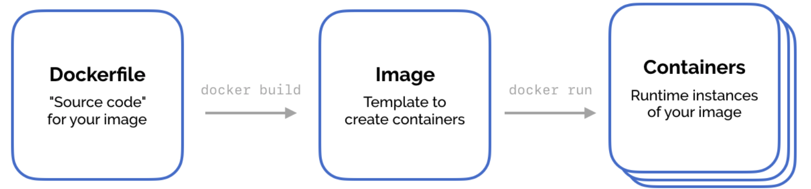

# k8s-developments


To follow the all instructions use my [gitbook](https://santillanrodriguezcristian.gitbook.io/k8s-development/)
=======
## **Containers**

### Docker and containers

Containerization is packaging an application, it's dependencies, and it's configuration into a single unit. This unit is called an image. The image is then used as a template to construct live, running instances of this image. These running instances are called containers. A container consists of the image, a read-write filesystem, network ports, resource limits, and other runtime configuration. Docker is the most popular way to build images and run containers, and is what we use in this book.



Consider a simple Node.js application that has not been containerized. If you were deploying this on a fresh virtual machine, you'd need to: • install the operating system • install the Node.js runtime • copy your application's source code into place • run your code using Node Of that list, you really only take responsibility for your source code. When you deploy a new version of your application, you just swap out the old source code for the newer version. The operating system and Node.js stays in place. When you package your application into a container, you take responsibility for everything you need to run your application—the OS, the runtime, the source code, and how to run it all. It all gets included into the image, and the image becomes your deployment unit. If you change your source code, you build a new image. When you redeploy your code, you instantiate a new container from the image. Conceptually, this is great. Encapsulate everything your application needs into a single object, and then just deploy that object. This makes deployment predictable and reproducible—exactly what you want for something that’s typically outside an application developer’s expertise. But alarm bells might be ringing: why aren't these images huge and expensive to run? The image includes the whole operating system and the Node.js runtime! Docker uses layers—read-only intermediate images—that are shared between final images. Each command used to generate the Docker image generates a new intermediate image via a delta—essentially capturing only what changed from the previous intermediate step. If you have several applications that call for the Ubuntu operating system in their Dockerfile, Docker will share the underlying operating system layer between them. There are two analogies that might help depending on your familiarity with other technologies. React—the JavaScript framework—re-renders all your UI whenever your application's state changes. Like including an operating system in your application deployment, this seems like it should be really expensive. But React gets smart at the other end—it determines the difference in DOM output and then only changes what is necessary. The other analogy is the git version control system, which captures the difference between one commit and the previous commit so that you can effectively get a snapshot of your entire project at any point in time. Docker, React, and git take what should be an expensive operation and make it practical by capturing the difference between states. Let's create a Docker image to see how this works in practice. Start a new directory, and save the following in a file called **Dockerfile.**

```text
# Get the Node.js base Docker image - shared!
FROM node:carbon
# Set the directory to run our Docker commands in
WORKDIR /app
# Copy your application source to this directory
COPY . .
# Start your application
CMD [ "node", "index.js" ]
```


