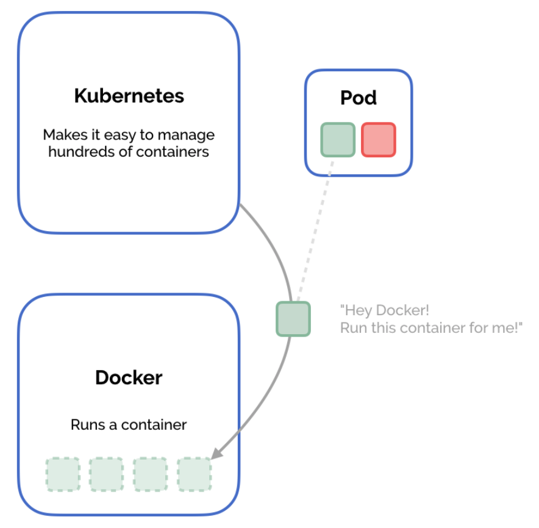

# Pods

Docker wasn't designed to coordinate running hundreds of containers across multiple computers. Its responsibility is to build images and run containers—it's a container runtime. This is where Kubernetes comes in. Kubernetes is a container orchestration system—it automates the deployment and scaling of containers. Kubernetes' responsibility is to manage hundreds of containers across many computers. It takes control of their uptime, networking, storage, and scheduling. When it needs to actually run a container, Kubernetes leaves that responsibility to the container runtime. The most popular container runtime is Docker, which is what we use in this book, but Kubernetes also supports other container runtimes like rkt and containerd. Rather than working with containers directly, Kubernetes adds a small layer of abstraction called a pod. A pod contains one or more containers, and all the containers in a pod are guaranteed to run on the same machine in the Kubernetes cluster. Containers in a pod share their networking infrastructure, their storage resources, and their lifecycle. In the previous chapter, we ran our Node.js web server using the `docker run` command. Let's do the equivalent with Kubernetes.



## Creating a Kubernetes pod

We're going to create a Dockerfile that defines a Docker image for a simple web server that runs on Node.js. We'll use Docker to build this image. This is essentially the same as what we did in the previous example. But instead of using `docker run` to create a container running the image, we'll define a pod in Kubernetes that uses the image. Finally, we'll create the pod in Kubernetes, which runs the container for us. Then we'll access the pod and make sure our container is running.

First, let's create a simple web server using Node.js. When a request is made to localhost:3000, it responds with a welcome message. Save this in a file called **index.js**

```text
//index.js
var http = require('http');
var server = http.createServer(function(request, response) {
 response.statusCode = 200;
 response.setHeader('Content-Type', 'text/plain');
 response.end('Welcome to the Golden Guide to Kubernetes
Application Development!');
});
server.listen(3000, function() {
 console.log('Server running on port 3000');
});
```

Next, we'll create a **Dockerfile** -- the file that gives Docker instructions on how to build our Docker image. We start from the Node.js image, mix in our **index.js** file, and tell the image how to start containers when they are instantiated.

```text
# Dockerfile
FROM node:carbon
WORKDIR /app
COPY . .
CMD [ "node", "index.js" ]
```

Now we've got to build this image. take note that we need to make sure this image is available to the Docker engine in our cluster. If you're running a cluster locally with Minikube, you'll need to configure your Docker settings to point at the Minikube Docker engine rather than your local \(host\) Docker engine. This means that when we do docker build, the image will be added to Minikube's image cache and available to Kubernetes, not our local one, where Kubernetes can't see it.

> `You will need to re-run this command each time you open a new shell.`

```bash
$ eval (minikube docker-env)
# This command doesn't produce any output.
# What does it do? It configures your Docker settings
# to point at Minikube's Docker engine, rather than the local one,
# by setting some environment variables.
# set -gx DOCKER_TLS_VERIFY "1";
# set -gx DOCKER_HOST "tcp://192.168.99.100:2376";
# set -gx DOCKER_CERT_PATH "/Users/matthewpalmer/.minikube/certs";
# set -gx DOCKER_API_VERSION "1.23"; 

$ docker build . -t my-first-image:1.0.0
#Sending build context to Docker daemon 4.096kB
# Step 1/4 : FROM node:carbon
# ---> ba6ed54a3479
# Step 2/4 : WORKDIR /app
# ---> Using cache
# ---> 3daa6d2e9d0b
# Step 3/4 : COPY . .
# ---> c85c95b4a4be
# Step 4/4 : CMD [ "node", "index.js" ]
# ---> Running in 2e68c5316ed9
# Removing intermediate container 2e68c5316ed9
# ---> 4106fb401625
# Successfully built 4106fb401625
# Successfully tagged my-first-image:1.0.0
```

The **-t** flag specifies the tag for an image - by convention it's the name of your image plus the version number, separated by a colon.

Now that we've built and tagged an image, we can run it in Kubernetes by declaring a pod that uses it. Kubernetes lets you declare your object configuration in YAML or JSON. This is really beneficial for communicating your deployment environment and tracking changes. If you're not familiar with YAML, it's not complicated - search online to find a tutorial and you can learn it in fifteen minutes.

Save this configuration in a file called pod.yaml. We'll cover each field in detail in the coming chapter, but for now the most important thing to note is that we have a Kubernetes pod called **my-first-pod** that runs the **my-first-image:1.0.0** Docker image we just built. It instantiates this image to run in a container called **my-first-container**.

`pod.yaml`

```yaml
kind: Pod
apiVersion: v1
metadata:
 name: my-first-pod
spec:
 containers:
 - name: my-first-container
 image: my-first-image:1.0.0
```

While you can create things directly on the commnad line with kubectl, one of the biggest benefits of Kubernetes is that you can declare your deployment environments explicitly and clearly through YAML. These are simple text files that can be added to your source control repository, and changes to them can be easily tracked throughout your application's history. For this reason, we prefer writing our Kubernetes resources configuration into a YAML file, and then creating those resources from the file.

When working with resources declared in a YAML file in kubernetes, there are several useful commands. All of them use the **-f** argument followed by the path to the file containing our YAML.

| COMMAND | DESCRIPTION |
| :--- | :--- |
| **kubectl create -f &lt;filename&gt;** | This command explicitly creates the object declared by the YAML |
| **kubectl delete -f &lt;filename&gt;** | This command explicitly deletes the object declared by the YAML |
| **kubectl replace -f &lt;filename&gt;** | This command explicitly updates a running object with the new one declared by the YAML |
| **kubectl apply -f &lt;filename or directory&gt;** | This command uses declarative configuration, which essentially gives Kubernetes control over running create, delete, or replace operations to make the state of your Kubernetes cluster reflect the YAML declared in the file or directory. While using **kubectl apply** can be harder to debug since it's not as explicit, we often use it instead of  **kubectl create**  and  **kubectl replace**. |

Choose either **create** or **apply,** depending on which makes more sense to you, and create the pod.

```text
$ kubectl create -f pod.yaml
pod "my-first-pod" created
$ kubectl get pods
NAME READY STATUS RESTARTS AGE
my-first-pod 1/1 Running 0 11s
```

Great! Our pod looks like it's running. You might be tempted to try to access our container via [http://localhost:3000](http://localhost:3000) like we did when we ran the container directly on our local Docker engine. But this wouldn't work. Remember that Kubernetes has taken our pod and run its containers on the Kubernetes cluster—Minikube—not our local machine. So to access our Node.js server, we need to be inside the cluster. We'll cover networking and exposing pods to the wider world in the coming chapters. The **kubectl** **exec** command lets you execute a command in one of the containers in a running pod. The argument **-it** allows you to interact with the container. We'll start bash shell on the container we just created \(conceptually, this is kind of similar to SSH sign in to your pod\). Then we'll make a request to our web server using **curl**.

```bash
$ kubectl exec -it my-first-pod -c my-first-container bash
root@my-first-pod:/app # curl 'http://localhost:3000'
Welcome to the Golden Guide to Kubernetes Application Development!
```

We've successfully created a Docker image, declared a Kubernetes pod that uses it, and run that pod in a Kubernetes cluster!

